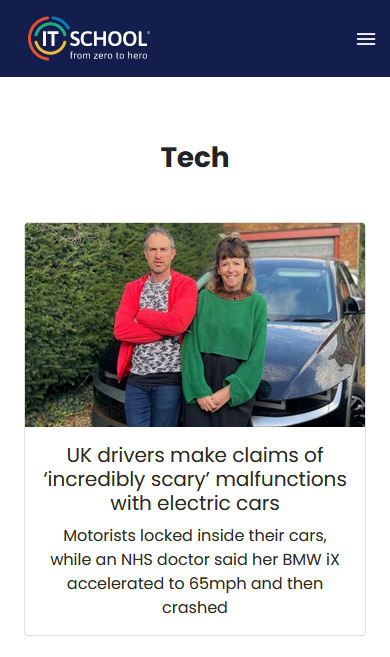
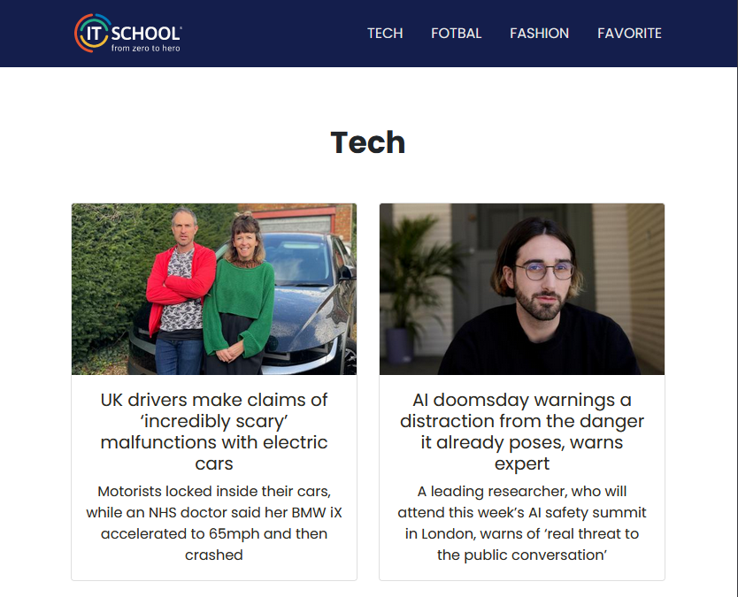
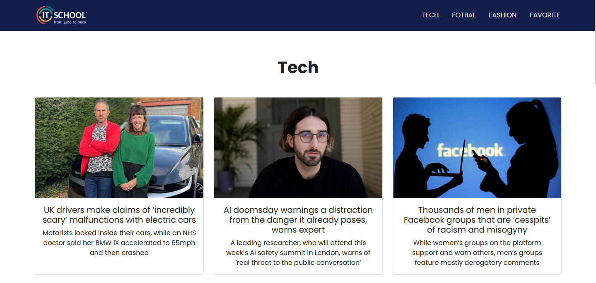

# IT-School News App

Project 3 from my web development course @ IT School.

## DEMO 

To view the project deployed on Netlify, please click on [It School News App](https://proiect-it-school-news.netlify.app/).

## Table of contents

- [Overview](#overview)
  - [Preview](#preview)
- [The process](#my-process)
  - [Usage](#usage)
  - [Main Features](#main-features)
  - [Built with](#built-with)
  - [What I learned](#what-i-learned)
  - [Useful resources](#useful-resources)
- [Acknowledgments](#acknowledgments)

## Overview

### Preview 

This a short preview of the project's view on mobile, tablet and desktop devices.

| MOBILE SCREEN                                                  |              TABLET SCREEN                                       |
| -------------------------------------------------------------- | ---------------------------------------------------------------- |
|      |        |

DESKTOP SCREEN                                                             
:--------------------------------------------------------------------------:
|             |

## The process

### Usage 

This is a single page application news (SPA). The app has a main page including three sections of different topics (technology, fotball and fashion) and a favorite section with related info . 
The right side of the nav bar allows the user to navigate throw the different sections extended in different pages by clicking each name. The logo will bring back the user to the main page. 
By clicking on each news, the user can access more information (article's date, content,related links etc.) about it. Each news article has a favorite button for adding the liked ones to the favorite page. 
All the favorite articles, can be found into the Favorites section. 

### Main Features

- Used [Guardian API](https://open-platform.theguardian.com/access/) to display current news info for different topics (technology, football and fashion) in different sections and different pages;
- Used React for creating a SPA (single page application) news; 
- Used React Router to create the router environment and navigate between pages;
- Added possibility to change current news page by using Hooks (useFetch(), useParams(), useSearchParams());
- Persisted data through useLocalStorage. 

### Built with

- IDE (integrated development environment): VS Code; 
- HTML5
- CSS3
- JavaScript (ES6)
- REACT
- REACT Bootstrap
- Node.js , npm
- JSON
- APIs
- POSTMAN
- Netlify
- Git / GitHub

### What I learned

This project allowed me to increase my knowledge and abilities by applying key concepts like:

- creating a SPA in VS code by using Node.js, npm and react dependencies;
- responsive design for desktop, tablet and mobile screens by using React Bootstrap;
- JSX code modules in components and pages for better readability and debugging;
- CSS modules coresponding to components and pages;
- obtaining information in real time by using APIs, API key and Postman, useFetch() hook;
- displaying information in real time for every day with different news displayed in the reppresented pages;
- creating the routing environment for the project by using React Router dependency;
- giving functionality to the application by allowing the user to add and delete news from favorites page by using useContext(), useReducer();
- how to make data to persist after refreshing the web browser by using useLocalStorage() hook;
- deploying the project on Netlify by using Node.js, npm and Netlify;
- learning markdown language and creating a README.md document within informations about the project for the users ;

### Useful resources 

- Mentor and Web Development course by IT School;
- [Guardian API](https://open-platform.theguardian.com/access/);
- [Guardian API Documentation](https://open-platform.theguardian.com/documentation/);
- [MDN](https://developer.mozilla.org/en-US/);
- [Markdown Guide](https://www.markdownguide.org/);
- [Codecademy](https://www.codecademy.com)
- [Blank page after deployment](https://stackoverflow.com/questions/55568697/blank-page-after-running-build-on-create-react-app)
- [Command failed with npm run build](https://answers.netlify.com/t/netlify-not-building-command-failed-with-exit-code-1-npm-run-build/16999)

### Acknowledgments

- Mentor: Rosian Mihai.
- IT School;

(<a href="#readme-top">back to top</a>)

